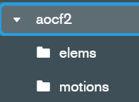
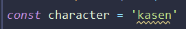
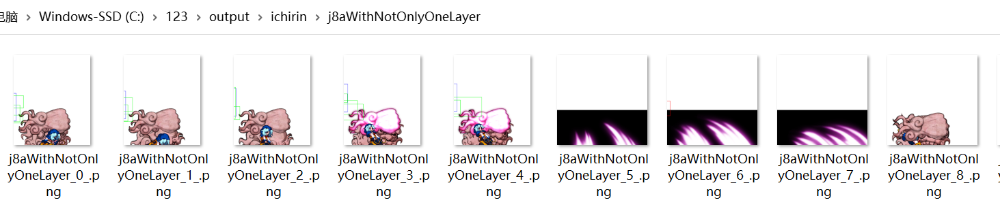

## how to use this script
this is a node script, so you may need to install nodejs environment  
what we need to install:
- nodejs  
  goto https://nodejs.org/ and just download the LTS version  
  it is a setup so you dont need to do something special(but remember to ADD to PATH)  
  after finishing setup input "node -v" in command prompt, if there is a version, it is done  

- mongodb(because im too lazy so i use mongodb to search elems)  
1. goto https://www.mongodb.com/try/download/community and just download the version suitable.  
2. do as the setup finished(you can also install mongodb compass to get GUI operations)
in the command prompt, use "cd" to go to the installation dir and start mongo.exe
  
there will be lots of infos, then you can use the mongosh commands
  
3. input "use aocf", mongo will auto create the database.  
(i used this name "aocf" in my code as the database name, you can use what you want)  
(if you change the name, just change the dbName in the code here:)  

4. input `db.createCollection("elems")` and `"db.createCollection("motions")"`  
then what we need is done.   

### modules we need
this script used following modules:   
- sharp  
- mongodb node driver  
- ~~fs(node)~~ (already built in node so you dont need to install)  
it is quite easy, just open the command prompt, cd to your working directory and input
`npm install`, as i included the package.json file.  
or you can also install manually: `npm install sharp` and `npm install mongodb`

- then the preparation is done.

### global params
- character name  
  
  - it is the character you want to generate frame data.
  - we need to keep the name same as the json file.
  - e.g. we want kasen frame, we need the json file named "kasen.json" within.
- motionID and outputDir  

  - motionID is the numberID in the nut file we got.
  - nut file is from https://github.com/MathyFurret/th155-decomp
  - 
  - we know the j5a is 1110 in the game.
  - (there is also some usual ID we use, i wrote them in the comment, except the C series which is skillA/B/C... but not 2c/5c/8c or what. so the comment is not fully correct)
  - outputDir is the output directory name, the image we get will be named by it.
  - just name it as you want. e.g. j5a, ja or what.
- Offset and width/height  
  
  - this change the width and height of output image.
  - e.g. the ichirin j8a, it is quite big, what we got is this.
  
  - it is terrible. so we change the height and width.
  
  - then we got this.  
  
  - good.
  - if you set them to 0, the file output will use the default solution of original image.  
### input the frame data to mongodb
edit the character name you want, and put the json file in.  
  
  
i used the two functions to input the data, to quickly search the elem we need (im lazy whatever):  
`async function updateElem()` and `async function updateMotion()`  
just cancel the comment and run the function.(remember to comment the main function)

then run the script, in the command prompt, use
`node box.js`
you will see this:  
  
that is we put all the elements and motions into the database.
then we can use them to generate image.
### generate the image
- preparing the image.
  - put your source image(you can get them by touhouSE) in the working directory:  
    
    
  - (if you do not have the actor fir, you could get the actor dir by touhouSE.)    
    
- set the motion you want to get
  1. change the motion you want to use.
  e.g. kasen j5a.  
    
    
  2. and just run the script  
  
  3. check the output dir  
  
  shit, finally!
  4. if you want to change the solution, just edit the width/height, the x/y Offset param.  
### problems im going to solve
  you know, some motions do not have only one layer, e.g. ichirin j8a.  
  whatever, the script do not distinguish the correct layer itself.
  and then we got...  
  
  WT** is this?
  obviously, it is because the location information of layer of other elements(e.g. the hand of unzan)
  and i just use the collision/hurt/hit box info of the first layer.  
    
  so i would continue to change the code, maybe i could manually check which layer is correct.
  for now, the solution i used is directly filter the irrelevant layer. e.g.:

    if (elem['path'].toLowerCase().includes('effect')) continue;
    if (elem['path'].toLowerCase().includes('unzan')) continue;
    if (elem['path'].toLowerCase().includes('hand')) continue;
    if (elem['path'].toLowerCase().includes('head')) continue;
    if (elem['path'].toLowerCase().includes('ball')) continue;
    if (elem['path'].toLowerCase().includes('test')) continue;
    if (elem['path'].toLowerCase().includes('skill_cushion0')) continue;
    
  
  it is quite dirty...but it works indeed, just like my code, lol.
  the result is:  
  
  whatever, ok.  
  im too lazy so the code is very dirty and inelegant, 
  maybe i will change the code slowly. but if it helps you,
  i will feel quite honored. thanks.

  
  